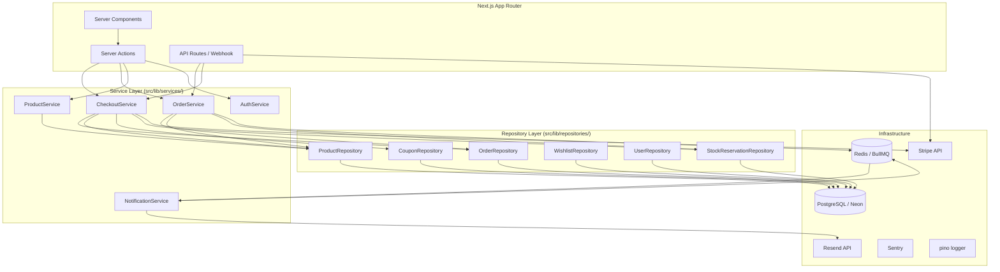
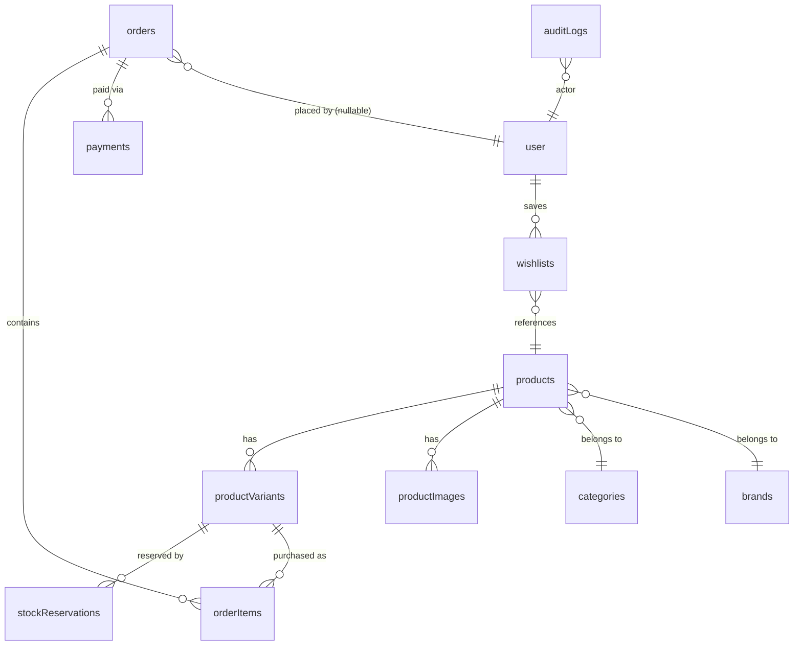

# Design Document — Aero Store v2

## Overview

Aero Store v2 is an incremental hardening of the existing Next.js 16 / PostgreSQL / Stripe e-commerce platform. The upgrade preserves the full existing stack while layering in:

- A **service + repository architecture** that decouples business logic from Next.js Server Actions
- **Checkout reliability** via idempotent order creation, stock reservation, and guest checkout
- **Security hardening** via Zod input validation, configurable rate limiting, Stripe webhook signature enforcement, and RBAC
- **Observability** via pino structured logging and Sentry error tracking
- **Background jobs** via BullMQ (with in-process fallback when Redis is absent)
- **Catalog features** via PostgreSQL full-text search, inventory alerts, coupons, and wishlists
- **Caching** via Next.js ISR + optional Redis query cache
- **Admin panel** enhancements for product, order, and inventory management
- **SEO** via `generateMetadata`, JSON-LD, sitemap, and robots.txt
- **Data consistency** via soft deletes and an append-only audit log
- **Performance** via targeted database indexes

The migration is designed to be non-breaking: existing pages, components, and Drizzle schemas remain valid. New layers are added alongside existing code and Server Actions are refactored to delegate to services rather than rewritten from scratch.

---

## Architecture

### Layer Diagram



### Key Architectural Decisions

**Service layer returns typed results, never throws to callers.** Every service method returns `{ data: T } | { error: string }`. This keeps Server Actions thin and makes services independently testable.

**Repository layer is the sole Drizzle consumer.** No file outside `src/lib/repositories/` imports from `src/lib/db` or executes Drizzle queries. This enforces a clean boundary and makes query changes localized.

**BullMQ with in-process fallback.** When `REDIS_URL` is absent (local dev, CI), critical jobs (order confirmation email) execute synchronously inline. Non-critical jobs (low-stock alerts) are skipped with a warning log.

**Neon HTTP driver limitation.** The Neon serverless HTTP driver does not support interactive transactions. Multi-step atomic operations use Neon's `neon()` function with `{ fullResults: true }` or are structured with an idempotency guard as the safety net (as the existing `createOrder` already does). Where true transactions are needed, the design calls for `db.transaction()` which Drizzle supports via the WebSocket driver (`@neondatabase/serverless` ws mode).

---

## Components and Interfaces

### Service Layer

#### `CheckoutService` (`src/lib/services/checkout.service.ts`)

```typescript
interface CheckoutService {
  initiateCheckout(input: InitiateCheckoutInput): Promise<ServiceResult<{ url: string }>>;
  validateCoupon(code: string, subtotal: number): Promise<ServiceResult<CouponValidation>>;
}

type InitiateCheckoutInput = {
  cartId: string;
  userId?: string;
  couponCode?: string;
};

type CouponValidation = {
  coupon: Coupon;
  discountedTotal: number;
};
```

Responsibilities: stock verification, stock reservation, Stripe session creation, coupon validation, Stripe minimum enforcement.

#### `OrderService` (`src/lib/services/order.service.ts`)

```typescript
interface OrderService {
  createFromStripeSession(session: Stripe.Checkout.Session): Promise<ServiceResult<{ orderId: string }>>;
  updateStatus(orderId: string, newStatus: OrderStatus, actorId: string): Promise<ServiceResult<void>>;
  getOrder(orderId: string): Promise<ServiceResult<OrderDetail>>;
  getOrdersByUser(userId: string, page: number): Promise<ServiceResult<PaginatedOrders>>;
}
```

Responsibilities: idempotency check, transactional order + items + payment insert, inventory decrement, coupon usage increment, stock reservation cleanup, low-stock alert enqueueing, audit logging.

#### `ProductService` (`src/lib/services/product.service.ts`)

```typescript
interface ProductService {
  search(query: string, filters: ProductFilters): Promise<ServiceResult<ProductListing[]>>;
  getById(id: string): Promise<ServiceResult<ProductDetail>>;
  create(input: CreateProductInput, actorId: string): Promise<ServiceResult<{ productId: string }>>;
  update(id: string, input: UpdateProductInput, actorId: string): Promise<ServiceResult<void>>;
  softDelete(id: string, actorId: string): Promise<ServiceResult<void>>;
  togglePublished(id: string, actorId: string): Promise<ServiceResult<{ isPublished: boolean }>>;
}
```

Responsibilities: full-text search via `tsvector`, ISR revalidation on mutations, soft-delete enforcement, audit logging.

#### `NotificationService` (`src/lib/services/notification.service.ts`)

```typescript
interface NotificationService {
  sendOrderConfirmation(to: string, order: OrderFull, name?: string): Promise<void>;
  sendShippingNotification(to: string, orderId: string, tracking?: string): Promise<void>;
  sendLowStockAlert(variant: VariantAlertInfo): Promise<void>;
}
```

Responsibilities: Resend API calls, React Email rendering, error logging + retry enqueueing.

#### `AuthService` (`src/lib/services/auth.service.ts`)

```typescript
interface AuthService {
  getSession(): Promise<Session | null>;
  requireAuth(): Promise<Session>;
  requireRole(role: "admin" | "user"): Promise<Session>;
}
```

Wraps `auth.api.getSession` and centralises role enforcement. Used by Server Actions and route handlers.

### Repository Layer

Each repository follows this pattern:

```typescript
// Example: OrderRepository
export class OrderRepository {
  constructor(private db: Db) {}

  async findByTransactionId(transactionId: string): Promise<Payment | null>
  async createWithItems(data: CreateOrderData): Promise<Order>
  async findById(id: string): Promise<OrderDetail | null>
  async findByUserId(userId: string, page: number, pageSize: number): Promise<Order[]>
  async updateStatus(id: string, status: OrderStatus): Promise<void>
  async listAll(page: number, pageSize: number): Promise<Order[]>
}
```

Repositories: `OrderRepository`, `ProductRepository`, `CouponRepository`, `WishlistRepository`, `UserRepository`, `StockReservationRepository`, `AuditLogRepository`.

### Background Job Queue (`src/lib/jobs/`)

```typescript
// Job type definitions
type JobName =
  | "send-order-confirmation"
  | "send-low-stock-alert"
  | "reconcile-payment"
  | "expire-stock-reservations";

// Queue setup (BullMQ)
// src/lib/jobs/queue.ts — exports `jobQueue` (BullMQ Queue) or null
// src/lib/jobs/worker.ts — BullMQ Worker processing jobs
// src/lib/jobs/scheduler.ts — BullMQ Scheduler for recurring jobs
```

When `REDIS_URL` is absent, `jobQueue` is `null` and a `runJobInProcess(name, data)` fallback executes critical jobs synchronously.

### Rate Limiter (`src/lib/utils/rateLimit.ts`)

The existing in-memory rate limiter is extended to support configurable limits per action:

```typescript
export function checkRateLimit(
  key: string,
  options: { maxRequests: number; windowMs: number }
): { allowed: boolean; retryAfterSeconds: number }
```

Keys are namespaced: `signin:{ip}`, `checkout:{userId|guestSessionId}`, `coupon:{userId|guestSessionId}`.

### Cache Layer (`src/lib/cache/`)

```typescript
// src/lib/cache/redis.ts
export const redis: Redis | null  // ioredis client, null if REDIS_URL absent

// src/lib/cache/index.ts
export async function cacheGet<T>(key: string): Promise<T | null>
export async function cacheSet<T>(key: string, value: T, ttlSeconds: number): Promise<void>
export async function cacheDel(key: string): Promise<void>
```

Falls back to returning `null` (cache miss) when Redis is unavailable, causing the caller to fetch from DB.

### Logger (`src/lib/logger.ts`)

```typescript
import pino from "pino";

export const logger = pino({
  level: process.env.LOG_LEVEL ?? "info",
  transport: process.env.NODE_ENV !== "production"
    ? { target: "pino-pretty" }
    : undefined,
});

// Request-scoped child logger with traceId
export function createRequestLogger(traceId: string) {
  return logger.child({ traceId });
}
```

---

## Data Models

### New / Modified Tables

#### `stockReservations` (new)

```typescript
export const stockReservations = pgTable(
  "stock_reservations",
  {
    id: uuid("id").primaryKey().defaultRandom(),
    stripeSessionId: text("stripe_session_id").notNull(),
    productVariantId: uuid("product_variant_id")
      .notNull()
      .references(() => productVariants.id),
    quantity: integer("quantity").notNull(),
    expiresAt: timestamp("expires_at").notNull(),
    createdAt: timestamp("created_at").notNull().defaultNow(),
  },
  (t) => [index("idx_stock_reservations_expires_at").on(t.expiresAt)]
);
```

#### `auditLogs` (new)

```typescript
export const auditLogs = pgTable("audit_logs", {
  id: uuid("id").primaryKey().defaultRandom(),
  actorId: uuid("actor_id").notNull(),
  action: text("action").notNull(),          // e.g. "product.update", "order.status_change"
  resourceType: text("resource_type").notNull(),
  resourceId: text("resource_id").notNull(),
  before: jsonb("before"),
  after: jsonb("after"),
  createdAt: timestamp("created_at").notNull().defaultNow(),
});
```

#### `products` (modified — add columns)

```typescript
// Added to existing products table:
searchVector: customType<{ data: string }>({ dataType: () => "tsvector" })("search_vector"),
deletedAt: timestamp("deleted_at"),
```

GIN index on `searchVector`:
```typescript
index("idx_products_search_vector").using("gin", t.searchVector)
```

#### `productVariants` (modified — add column)

```typescript
// Added to existing productVariants table:
lowStockThreshold: integer("low_stock_threshold").notNull().default(5),
```

#### `coupons` (modified — add column)

```typescript
// Added to existing coupons table:
deletedAt: timestamp("deleted_at"),
```

#### `orders` (modified — add indexes)

```typescript
// Added indexes:
index("idx_orders_user_id").on(t.userId),
index("idx_orders_created_at").on(t.createdAt),
```

#### `payments` (modified — add unique index)

```typescript
// transactionId gets a unique index:
uniqueIndex("idx_payments_transaction_id_unique").on(t.transactionId),
```

#### `wishlists` (modified — add unique composite index)

```typescript
// Existing wishlists table gets:
uniqueIndex("idx_wishlists_user_product").on(t.userId, t.productId),
```

### Schema Diagram (core tables)



### Zod Validation Schemas

All public-facing inputs use `drizzle-zod`-derived schemas with additional refinements:

```typescript
// src/lib/validations/checkout.ts
export const initiateCheckoutSchema = z.object({
  couponCode: z.string().max(50).optional(),
});

// src/lib/validations/coupon.ts
export const applyCouponSchema = z.object({
  code: z.string().min(1).max(50).trim(),
});

// src/lib/validations/review.ts
export const submitReviewSchema = createInsertSchema(reviews).pick({
  rating: true, body: true, productId: true,
}).extend({ rating: z.number().int().min(1).max(5) });

// src/lib/validations/address.ts
export const createAddressSchema = createInsertSchema(addresses).omit({
  id: true, createdAt: true,
});

// src/lib/validations/product.ts (admin)
export const createProductSchema = createInsertSchema(products).omit({
  id: true, createdAt: true, updatedAt: true, searchVector: true, deletedAt: true,
});
```

---

## Correctness Properties

*A property is a characteristic or behavior that should hold true across all valid executions of a system — essentially, a formal statement about what the system should do. Properties serve as the bridge between human-readable specifications and machine-verifiable correctness guarantees.*

### Property 1: Idempotent order creation

*For any* Stripe session ID, calling `OrderService.createFromStripeSession` two or more times with the same session should result in exactly one order record and one payment record in the database.

**Validates: Requirements 2.1, 2.2**

---

### Property 2: Order total round-trip

*For any* completed Stripe checkout session, the `totalAmount` stored in the `orders` table (in dollars, 2 decimal places) should equal `stripeSession.amount_total / 100` rounded to 2 decimal places.

**Validates: Requirements 2.3, 22.6**

---

### Property 3: Stock reservation decrements inventory

*For any* cart with valid stock levels, initiating checkout should result in each variant's `inStock` being reduced by exactly the reserved quantity, and a corresponding `stockReservation` row existing with the correct session ID and quantity.

**Validates: Requirements 4.1, 4.3**

---

### Property 4: Stock expiry restores inventory

*For any* set of stock reservations, processing a `checkout.session.expired` event (or the cleanup job finding expired reservations) should restore each variant's `inStock` to its pre-reservation value and remove the reservation rows.

**Validates: Requirements 4.5, 4.6**

---

### Property 5: Whitespace-only and empty inputs are rejected

*For any* Zod-validated Server Action input, a payload where a required string field contains only whitespace characters should be rejected with a field-level validation error and the service layer should not be invoked.

**Validates: Requirements 5.1, 5.2**

---

### Property 6: Coupon discount never produces sub-minimum total

*For any* percentage coupon and any order subtotal, applying the coupon should produce a discounted total that is always ≥ $0.50 (Stripe minimum charge).

**Validates: Requirements 11.5, 11.6**

---

### Property 7: Coupon usage count increments atomically

*For any* valid coupon applied to a completed order, the coupon's `usedCount` after order creation should equal its `usedCount` before plus exactly 1.

**Validates: Requirements 11.4**

---

### Property 8: Full-text search returns only published, non-deleted products

*For any* search query, all returned products should have `isPublished = true` and `deletedAt IS NULL`.

**Validates: Requirements 9.2, 18.4, 23.3**

---

### Property 9: Search result ranking is by relevance descending

*For any* search query where multiple products match, the `ts_rank` of each result should be greater than or equal to the `ts_rank` of the next result in the list (non-increasing order).

**Validates: Requirements 9.3**

---

### Property 10: Soft-deleted records are excluded from standard queries

*For any* repository query that does not explicitly request deleted records, no row with a non-null `deletedAt` should appear in the result set.

**Validates: Requirements 23.2, 23.3**

---

### Property 11: Audit log entry created within same transaction as mutation

*For any* admin state-changing operation (product create/update/delete, order status change, inventory update), an `auditLogs` row with the correct `actorId`, `resourceId`, and `action` should exist after the operation completes.

**Validates: Requirements 8.4, 18.5, 20.4, 23.5**

---

### Property 12: Rate limit enforced per key

*For any* rate-limited action key, after `maxRequests` calls within the window, the next call should return `allowed: false` with a positive `retryAfterSeconds` value.

**Validates: Requirements 6.1, 6.2, 6.3, 6.4**

---

### Property 13: Wishlist toggle is idempotent in pairs

*For any* authenticated user and product, toggling the wishlist button twice in sequence should result in the wishlist returning to its original state (add then remove = no net change).

**Validates: Requirements 12.1, 12.2**

---

### Property 14: Order confirmation email sent for every completed order

*For any* completed order (guest or authenticated), the `NotificationService` should be called with the correct recipient email address and the order's ID.

**Validates: Requirements 3.5, 17.1**

---

### Property 15: Order listing is sorted by creation date descending

*For any* list of orders returned by the admin order listing query, the `createdAt` timestamp of each order should be greater than or equal to the `createdAt` of the next order in the list.

**Validates: Requirements 19.1**

---

### Property 16: Invalid order status transitions are rejected

*For any* order and any target status that is not a valid transition from the current status, the `OrderService.updateStatus` call should return an error and the order's status in the database should remain unchanged.

**Validates: Requirements 19.2, 19.3**

---

### Property 17: searchVector reflects current product content

*For any* product, after updating its name, description, or brand, a full-text search using the new terms should return that product, and a search using only the old terms (that no longer appear) should not return it.

**Validates: Requirements 9.5**

---

### Property 18: No duplicate low-stock alerts within 24 hours

*For any* product variant, if a low-stock alert has been sent within the last 24 hours, enqueueing a second low-stock alert job for the same variant should result in no additional email being sent.

**Validates: Requirements 10.5**

---

## Error Handling

### Service Result Pattern

All service methods return `ServiceResult<T>`:

```typescript
type ServiceResult<T> = { data: T } | { error: string; code?: ErrorCode };

type ErrorCode =
  | "INSUFFICIENT_STOCK"
  | "COUPON_INVALID"
  | "COUPON_EXPIRED"
  | "COUPON_EXHAUSTED"
  | "DUPLICATE_ORDER"
  | "NOT_FOUND"
  | "FORBIDDEN"
  | "VALIDATION_ERROR"
  | "EXTERNAL_SERVICE_ERROR";
```

Server Actions unwrap the result and return it to the client. They never re-throw.

### Webhook Error Handling

| Scenario | Response | Action |
|---|---|---|
| Missing `stripe-signature` | HTTP 400 | Log warning with IP |
| Invalid signature | HTTP 400 | Log error with IP, capture Sentry |
| Duplicate session ID | HTTP 200 | Log info, return existing order ID |
| DB transaction failure | HTTP 500 | Log error, capture Sentry, Stripe will retry |
| Unknown event type | HTTP 200 | No-op |
| Handler throws | HTTP 500 | Log error, capture Sentry |

### Email Delivery Errors

Resend errors are caught, logged at `error` level, and a retry job is enqueued via BullMQ. The webhook response is never blocked by email delivery.

### Redis / BullMQ Unavailability

- `jobQueue` is `null` when `REDIS_URL` is absent
- `enqueueJob()` checks for null and falls back to `runJobInProcess()` for critical jobs
- Non-critical jobs (low-stock alerts) log a warning and skip
- Cache reads return `null` (cache miss), causing DB fallback

---

## Testing Strategy

### Dual Testing Approach

Both unit tests and property-based tests are required. They are complementary:

- **Unit tests** verify specific examples, integration points, and error conditions
- **Property tests** verify universal invariants across randomly generated inputs

### Unit Tests (Vitest)

Location: `src/lib/services/__tests__/`, `src/lib/repositories/__tests__/`

Key unit test scenarios:
- `CheckoutService.initiateCheckout` with insufficient stock returns error
- `OrderService.createFromStripeSession` with duplicate session ID returns existing order
- `CouponService.validate` with expired coupon returns descriptive error
- `AuthService.requireRole("admin")` with non-admin user throws `FORBIDDEN`
- Zod schemas reject invalid inputs (empty strings, negative numbers, invalid UUIDs)

### Property-Based Tests (fast-check via Vitest)

Location: `src/lib/services/__tests__/*.property.test.ts`

Configuration: minimum **100 iterations** per property test.

Each test is tagged with a comment referencing the design property:
```typescript
// Feature: aero-store-v2, Property 1: Idempotent order creation
```

| Property | Test Description | Pattern |
|---|---|---|
| P1: Idempotent order creation | Generate random Stripe session, call createOrder twice, assert single order/payment row | Round-trip / Idempotence |
| P2: Order total round-trip | Generate random `amount_total` (integer cents), assert stored dollars = cents/100 | Round-trip |
| P3: Stock reservation decrements | Generate random cart quantities ≤ stock, assert inStock reduced by exact quantity | Invariant |
| P4: Stock expiry restores | Generate reservations, expire them, assert inStock restored to original | Round-trip |
| P5: Whitespace inputs rejected | Generate strings of whitespace chars, assert Zod rejects all | Error conditions |
| P6: Coupon minimum enforcement | Generate percentage coupons + subtotals, assert discounted total ≥ 0.50 | Invariant |
| P7: Coupon usage increment | Generate coupon with random usedCount, create order, assert usedCount + 1 | Invariant |
| P8: Search excludes unpublished/deleted | Generate mixed product sets, assert search returns only published+non-deleted | Metamorphic |
| P9: Search ranking descending | Generate search results with ts_rank scores, assert non-increasing order | Invariant |
| P10: Soft-delete exclusion | Generate records with mixed deletedAt, assert standard queries exclude deleted | Invariant |
| P11: Audit log on mutation | Generate admin operations, assert auditLogs row exists with correct fields | Round-trip |
| P12: Rate limit enforcement | Generate request counts > maxRequests, assert (maxRequests+1)th call is blocked | Invariant |
| P13: Wishlist toggle idempotence | Generate user+product pairs, toggle twice, assert original state restored | Idempotence |
| P14: Order confirmation email | Generate completed orders (guest + auth), assert NotificationService called with correct email | Invariant |

### Integration Tests (Vitest + test DB)

- Idempotent order creation: fire duplicate webhook payload, assert single order row
- Stock reservation + expiry: reserve stock, trigger expiry job, assert stock restored
- Guest checkout: session with `userId = null`, assert order created with `guestEmail`

### E2E Tests (Playwright)

- Guest checkout flow: add to cart → checkout → Stripe test payment → order confirmation page
- Authenticated user checkout flow: sign in → add to cart → checkout → order confirmation
- Admin RBAC: non-admin user redirected from `/admin` routes

### Property-Based Testing Library

**fast-check** (`npm install --save-dev fast-check`) is the chosen PBT library. It integrates natively with Vitest via `fc.assert(fc.property(...))` and provides rich arbitrary generators for strings, numbers, UUIDs, and custom domain objects.

```typescript
import { describe, it } from "vitest";
import fc from "fast-check";

// Feature: aero-store-v2, Property 2: Order total round-trip
it("order total round-trip", () => {
  fc.assert(
    fc.property(fc.integer({ min: 50, max: 1_000_000 }), (amountTotal) => {
      const stored = (amountTotal / 100).toFixed(2);
      const retrieved = parseFloat(stored);
      return Math.abs(retrieved - amountTotal / 100) < 0.001;
    }),
    { numRuns: 100 }
  );
});
```
